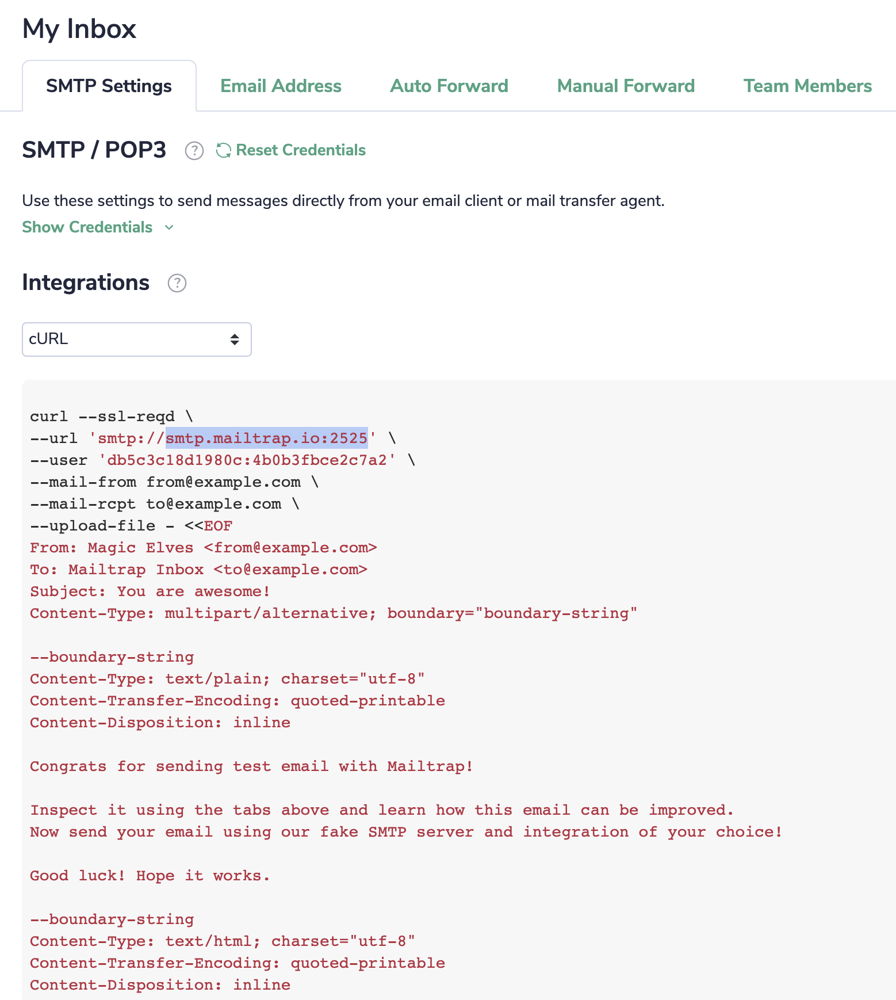
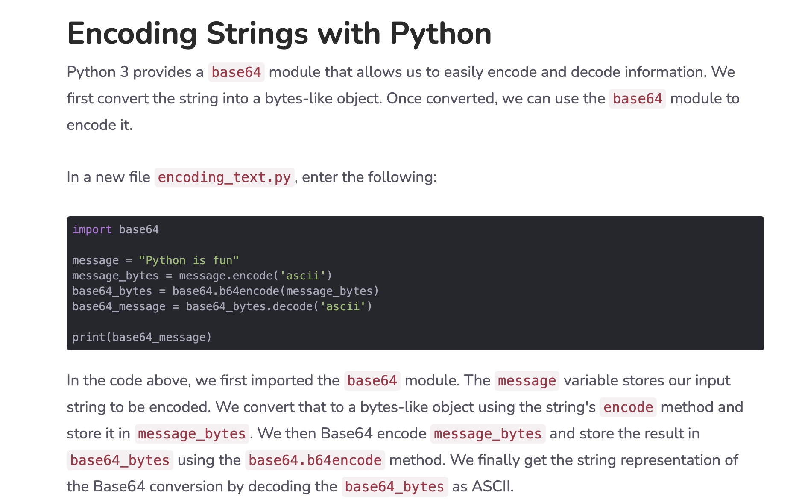

# SMTP Client Implmentation Using Socket

This is COMS4119 Homework, Programming Part 

## New EDIT:
A very good mail service called [Mailtrap](https://mailtrap.io/). It can fake a mail server in 
```python
smtp.mailtrap.io:2525
```
Notice that the port number is 2525.

With the mailtrap.io, we can even fake from address and to address. Mailtrap also gives an SMTP interface to learn



You can refer to [mailtrap version](smtp_mailtrap.py) for more detail.

```sh
python smtp_mailtrap.py
```


## How to run
For [plain text version](smtp.py), just change the fromaddr and toaddr and mailserver with your own authentication information, and the message you want, then run python file
```sh
python smtp.py
```

For [attachment version](smtp_attachment.py), it is for image (png) as attachment, in addition to change the info above, add your own image and change the image name, then run

```sh
python smtp_attachment.py
```

## Detail
There are five commands important in SMTP
```sh
HELO
MAIL FROM
RCPT TO
DATA
QUIT
```
It forms the basis of SMTP protocol. Note that after DATA session, you need to use "\r\n.\r\n" to indicate the end of data


For attachment part, I use the MIME format

What is MIME?
> https://en.wikipedia.org/wiki/MIME

Sample MIME message
> https://docs.microsoft.com/en-us/previous-versions/office/developer/exchange-server-2010/aa563375(v=exchg.140)

To include the attachment, the header hear is very inportant
```sh
Content-Type: image/png;
Content-Disposition: attachment; filename="cute.png"
Content-Transfer-Encoding: base64
```

Note that "Content-Transfer-Encoding: base64" cannot be omitted since I use  (and probably a lot of people) base64 encoding of the image. 


For more Content-Type
> https://developer.mozilla.org/en-US/docs/Web/HTTP/Basics_of_HTTP/MIME_types/Common_types


# Other Resources
https://docs.microsoft.com/en-us/previous-versions/office/developer/exchange-server-2010/aa563068(v=exchg.140)
https://stackabuse.com/encoding-and-decoding-base64-strings-in-python/
https://blog.mailtrap.io/sending-emails-in-python-tutorial-with-code-examples/#Sending_emails_with_attachments_in_Python
https://www.tutorialspoint.com/send-mail-with-attachment-from-your-gmail-account-using-python